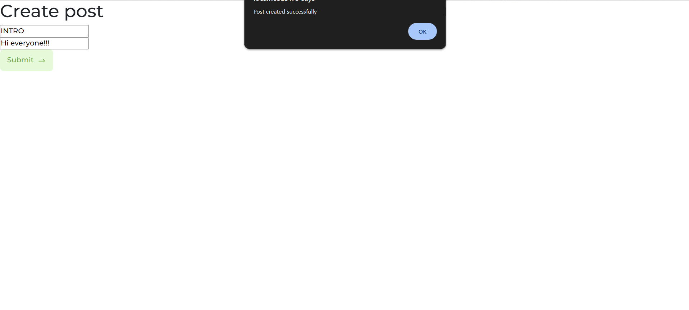

# Getting started

## Installation

Install client_v2

```bash
  cd React/client_v2/
  npm i
  npm run dev
```

Install updated_server_v3

```bash
  cd React/updated_server_v3/
  npm i
  npm run start_dev
```

## Authors

- [@faizabinte2000](https://github.com/faizabinte2000)
- [@SamihaZamangithub](https://github.com/SamihaZamangithub)
- [@mahbubalgazi](https://github.com/mahbubalgazi)
- [@Ahtesham-Ibne-Mostafa](https://github.com/Ahtesham-Ibne-Mostafa)

## Work contributions

### Faiza
1. Admit will be able to add or delete courses
Add course

Delete course


2. Admin or faculties can post in the forum.(By Me and Samiha)

Admin or faculties posting in the forum

Posts by admin

3. Arranging the code following MVC architecture

Before

After

### Samiha
1. Donors will be able to add their information and it will be updated in the database
Donation panel

2. Students will be able to enroll in courses and it will be updated in database
Enroll

3. Students will be able to post in the forum
Post Forum
